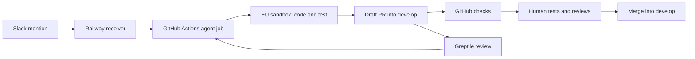

# Flakey Patch: Slack to a reviewed PR

Flakey Patch runs the TypeScript Deep Agent with GPT-6 Astra in **GitHub Actions**. A small **Railway** service receives Slack events. Code runs in **LangSmith EU Sandboxes**, and private traces go to the existing EU `slack-to-pr` project. LangSmith Deployments is not used.



## How to use it

1. In channel `C0C4AMGJEA3`, start a thread describing one small change. Mention **@Flakey Patch** with the request and acceptance criteria. Ordinary chat does not start coding.
2. The bot replies with a GitHub Actions run link. Astra reads the Slack thread, edits a branch from **develop**, and tests the changes in the EU sandbox.
3. It opens a **draft PR into develop**, with test evidence and a link to the source Slack thread. GitHub runs independent checks. Flakey Patch posts an explicit `@greptileai` review request once per published commit, so draft PRs can be reviewed too.
4. The agent checks for a review of the current commit once a minute for up to ten minutes. It can publish at most **two correction revisions** for valid findings. Each revision runs verification again.
5. Open the PR, inspect the changes and Greptile findings, and test the temporary Railway preview linked on the PR. Each preview builds the app's Docker images in its own environment. Railway removes the preview when the PR is merged or closed. A sandbox check alone is not a browser preview; wait for the Railway deployment to be healthy before testing.
6. Once the current commit's checks pass and findings are addressed, merge into **develop** in GitHub or use the explicit Slack commands below. Greptile alone never triggers a merge. Promotion from develop to main/production is a separate decision.

Example first request:

> @Flakey Patch change the application's main heading from “Know if you can ship. Know exactly why.” to “Ship with confidence. See the evidence.” Keep the layout and other text unchanged. Update a relevant test if one exists, and open a draft PR into develop.

Use the actual heading visible in the app if it differs. Follow-ups in the same Slack thread reuse the same branch and PR. After a PR is closed or merged, start a new thread. If Greptile is late, mention the bot with “check the review”.

### Approve and merge from Slack

Only the configured Slack owner (`FLAKEY_APPROVER_SLACK_ID`, currently `U0C4RUL6CMQ`) can run these commands, in the original task thread. The bot supplies the PR number and full 40-character commit SHA in its publication reply. Replace the example placeholders:

```text
@Flakey Patch approve #123 <full-commit-SHA>
@Flakey Patch merge #123 <same-full-commit-SHA>
@Flakey Patch revoke #123 <same-full-commit-SHA>
```

`approve` records your authorization, marks the draft ready for review, and pauses coding. Test the preview and inspect the PR before sending it. This is **Slack authorization, not a GitHub APPROVE review**: the publishing account cannot approve its own PR, and required independent reviews must still happen in GitHub. `merge` is a separate command that squash-merges only this task's PR into develop. `revoke` withdraws authorization without merging; send a new change request to resume coding. Casual discussion such as “we can approve it” never authorizes a merge.

Both approval and merge require a current Greptile review, successful `check` and `pr-agent` checks from GitHub Actions and a successful Greptile check, no other failing or pending checks/statuses, no outstanding change requests, and no unresolved review threads. The handler refuses incomplete thread listings. GitHub must enforce strict, up-to-date checks, conversation resolution and administrator rules on develop. The preview test remains your responsibility; these commands do not verify browser acceptance automatically.

Approval is stored in authenticated encrypted task state and bound to the PR, Slack owner, head commit and develop commit. PR comments are an audit trail, never authorization. A changed head or develop commit requires a fresh approval; merging rechecks the gates and supplies the expected head SHA to GitHub. Duplicate events and already-merged PRs do not trigger another merge. The commands cannot operate on the setup PR into main, a different task thread, forks or unrelated branches.

## Activation

### GitHub

The setup workflow must first exist on GitHub's **default branch (main)**. This is where the trusted agent code executes. It does not change the target for generated PRs: that is fixed to **develop**. Create develop from the current GitHub main when it does not yet exist.

The repository currently has a newer local application baseline that is separate from GitHub main. Publish only this agent package, `.github/workflows/flakey-patch.yml`, and the compatible quality workflow in the setup PR; do not silently replace the application baseline.

Configure these **Actions secrets** from the ignored agent `.env`:

- `LANGSMITH_API_KEY`
- `OPENAI_API_KEY`
- `SLACK_BOT_TOKEN`
- `SLACK_SIGNING_SECRET`
- `FLAKEY_GITHUB_TOKEN`
- `FLAKEY_STATE_KEY`
- Optional `SLACK_HISTORY_TOKEN`

`FLAKEY_GITHUB_TOKEN` is a fine-grained token restricted to this repository, with Contents read/write, Pull requests read/write, Metadata read and **Administration read**. Read-only Administration is needed to inspect branch-protection rules before an approval or merge; Administration write is not needed. The token creates PRs and commits instead of the workflow's built-in token, so the resulting CI events can run normally. The built-in token only reads code and Actions artifacts.

`FLAKEY_STATE_KEY` is 32 random bytes encoded as 64 hex characters. Keep the same value in the receiver and Actions. Losing or rotating it makes old requests and saved task state unreadable; retain it until existing tasks are closed, or explicitly migrate state.

Protect develop against force pushes and deletion. Require `check` and `pr-agent` from the GitHub Actions app, strict up-to-date checks, resolved conversations, and enforcement for administrators. Slack merging fails closed if these protections are missing. Greptile findings still need human assessment; a review arriving is not proof that the code is correct.

### Railway receiver

Use a separate service in the existing `flakeyflakey` project. Build `receiver.Dockerfile` with this directory as the Docker context, or deploy the bundled `dist/receiver.js` with Bun 1.3.12. The service requires no model or LangSmith keys.

Required receiver variables:

- `SLACK_TEAM_ID=T0C4U18AUC9`
- `SLACK_SIGNING_SECRET`
- `FLAKEY_DISPATCH_TOKEN`: repository-scoped token with Contents read/write and Metadata read. GitHub's repository-dispatch endpoint requires Contents write.
- `FLAKEY_STATE_KEY`: identical to the Actions secret
- `HOST=0.0.0.0`; Railway supplies `PORT` (default 8787)

Health endpoint: `/pr-agent/health`. Slack endpoint: `/slack/events`.

The receiver validates Slack's signature, timestamp, workspace, channel and mention type. It sends an authenticated, encrypted event to GitHub's `repository_dispatch` endpoint and acknowledges Slack only after GitHub accepts it. A failed dispatch returns a retryable error. There is no in-memory-only event queue.

### Slack and Greptile

In Slack app **A0C4MJW5X35**, enable Event Subscriptions and set the Request URL to the Railway receiver's HTTPS URL plus `/slack/events`. Confirm **Verified**, subscribe to **app_mention**, and save. Keep the bot invited to channel `C0C4AMGJEA3`.

Greptile is installed for `vasvalstan/flakeyflakey`; the repository must also be enabled in its dashboard. Publication sends its documented `@greptileai review this draft` request for each commit. Review polling accepts a formal review from the configured bot on the current commit, or a completed successful `Greptile Review` check from the verified Greptile app on that exact commit. Clean reviews can report completion through the check without a new formal review. Approval and merging always require that successful check plus all other gates. Summary text alone is never completion evidence. No Greptile API key is needed.

### Temporary Railway previews

The Railway project's PR Environments setting uses **development** as its base. This base contains only `web` and `studio-runner`, connected to develop. It contains no receiver credentials, model keys or production volume. Preview data lives in `/tmp/flakey` and is disposable. Both app services get their own private networking, and the web service gets a temporary public URL.

The development configuration can remain undeployed while testing only temporary PR environments. Running previews consume Railway resources until the PR is closed or merged; deleting a preview does not delete the PR or GitHub branch. The production app is independent of these preview environments.

The initial setup PR has a manually created `pr-1-setup-test` environment because it predates PR Environments being enabled. That environment requires explicit deletion after testing. Automatic creation and cleanup must be checked with the first new feature PR.

## Run state and limits

GitHub queues runs per Slack thread (`queue: max`, no cancellation of an active run). Each graph step writes encrypted state on the runner. The workflow uploads only `state.enc`, including after ordinary failures, with 90-day artifact retention. Later jobs restore only authenticated state from this repository's trusted agent workflow on the default branch. Slack retries are deduplicated by event ID.

A killed runner or failed artifact upload can lose the latest state. This is job-level recovery, not Agent Server's exact checkpoint recovery. If state is missing for an existing branch, the agent stops rather than resetting review budgets or creating another PR. Recover the encrypted artifact before continuing. Notifications can be duplicated if a process dies after Slack accepts a reply but before state is saved.

Required checks are frozen dependency installation, application tests in `src`, `server`, and `scripts` with a 30-second default timeout, and a production build. Existing `test:e2e` and `test:soak` scripts are also required, with 25 soak cycles. Checks are selected from the immutable baseline. The tested file digest must still match before publication. GitHub independently runs equivalent checks on the PR.

The current GitHub application baseline has no separate `test:e2e` or `test:soak` script. Its required `server/studio-service.test.ts` suite launches Chromium and tests recording, redaction, screenshots, replay and questionnaire flows. CI reports the absent optional scripts explicitly; it does not claim soak coverage.

The coding sandbox has Bun, Git and Chromium, runs as `pwuser`, and receives no OpenAI, Slack, GitHub or LangSmith credentials. Outbound HTTPS is restricted to npm registries. Publication rejects secrets, workflow edits, agent self-modification, path traversal and verification-script changes. Diffs are limited to 80 regular files and 3 MB; repository archives to 30 MB. Concurrent external branch changes cause the agent to stop.

The Actions job is limited to 120 minutes, each coding invocation to 20 minutes, and shell commands to 10 minutes. Sandboxes idle-stop after 30 minutes and are deleted a day after stopping. A later run reconstructs an expired sandbox from the published branch. Unpublished sandbox edits are not permanent.

Railway compute, Actions usage beyond applicable allowances, model tokens, sandbox compute and tracing can still cost money. Removing LangSmith Deployments removes that hosting dependency; it does not make all execution free. EU tracing/sandboxes do not imply EU processing for GitHub runners or OpenAI.

## Local checks

```bash
bun install --frozen-lockfile
bun run check
bun run build:receiver
bun run doctor
```

`bun run doctor` validates configured credentials, Slack history access, repository access, develop and the EU snapshot. It sends no Slack message, makes no model call and creates no PR. `--offline` only checks environment presence. `bun run snapshot` reuses or creates the tested EU sandbox image without uploading credentials. `bun run dev` starts the receiver on loopback; it needs an HTTPS forwarding endpoint for Slack to reach a local machine.

Tests mock model and provider calls, including multi-step Astra Responses tool use, signed ingress, encrypted dispatch/state, Actions retry deduplication, failed verification, stale reviews, two-round correction limits and non-force publication. Live provider setup and the first real Slack task must be verified separately.

Dependency exception: `deepagents@1.14.1` declares `langsmith <0.10.0`, but this package deliberately pins `langsmith@0.10.5`. Snapshot provisioning needs the newer `runConfig` API to capture a non-root `pwuser` environment; `0.9.0` lacks it. Keep this exception explicit until Deep Agents widens its peer range. Verification must include the agent tests, TypeScript checks and a disposable EU sandbox probe through `LangSmithSandbox` (execute and file upload/download), not installation alone. This does not establish compatibility with future SDK releases.

References: [GitHub dispatch](https://docs.github.com/en/rest/repos/repos#create-a-repository-dispatch-event), [Actions concurrency](https://docs.github.com/en/actions/how-tos/write-workflows/choose-when-workflows-run/control-workflow-concurrency), [Slack events](https://docs.slack.dev/apis/events-api/), [Railway PR environments](https://docs.railway.com/guides/preview-deployments-with-pr-environments), [Greptile draft reviews](https://www.greptile.com/docs/code-review/developer-essentials), [Deep Agents sandboxes](https://docs.langchain.com/oss/javascript/deepagents/sandboxes).
